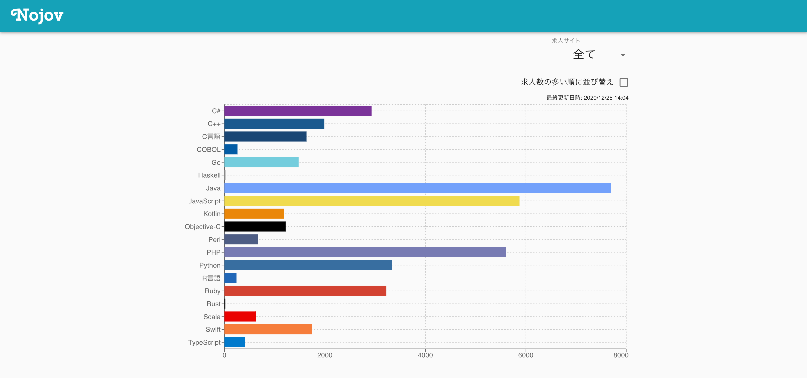
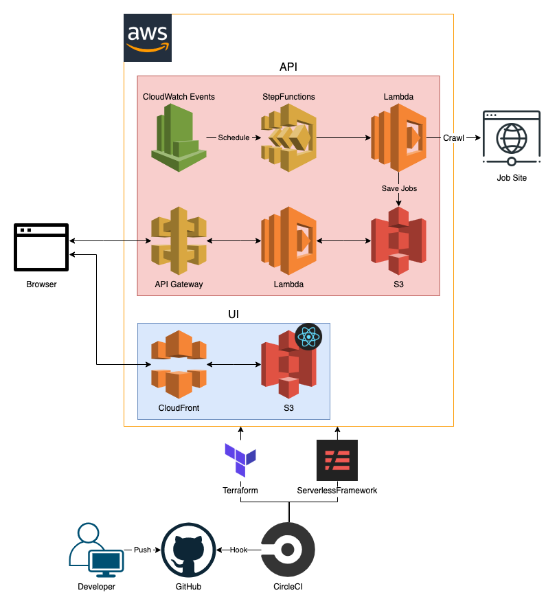

# Overview

Nojov allows you to see the number of job offers for each programming language today.

# Application

[Nojov \- プログラミング言語別求人数ビューア](https://nojov.kou-pg.com/)

# Architecture

# Technologies

## Language and Libraries

- TypeScript
- React.js
- React Router
- Material UI
- ESLint
- Jest

## AWS

- ACM
- API Gateway
- CloudFormation
- CloudFront
- CloudWatch
- IAM
- Lambda
- Route53
- S3
- StepFunctions

## CI/CD

- CircleCI

## Other

- Docker
- Docker Compose
- Serverless Framework
- Terraform

# LICENSE

[MIT](./LICENSE)
