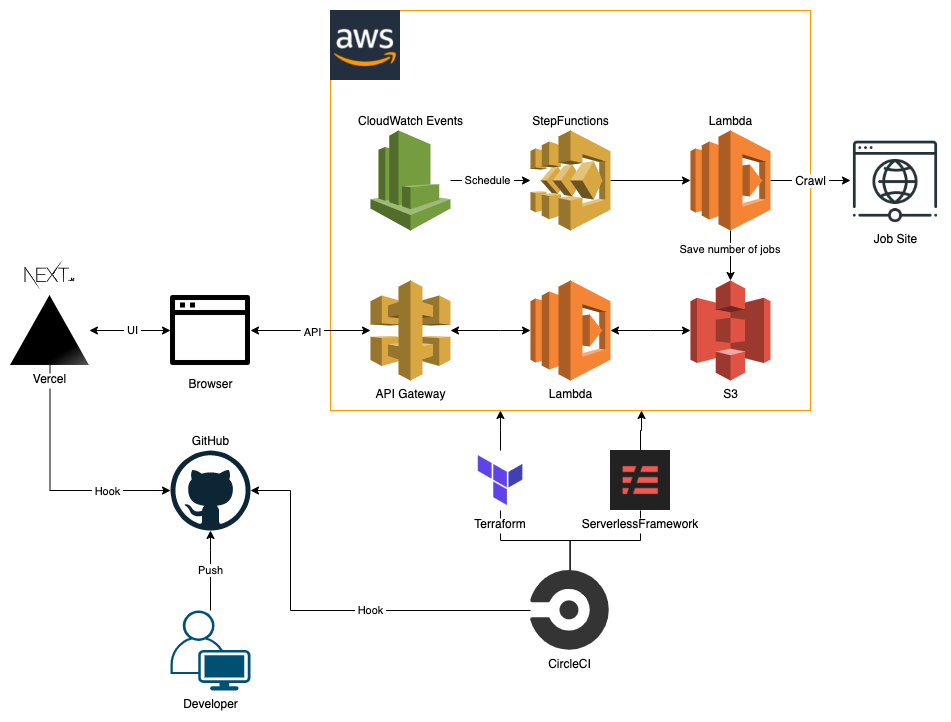

# Overview

Nojov allows you to see the number of job offers for each programming language today.  
API: [github.com/kou-pg-0131/nojov-api](https://github.com/kou-pg-0131/nojov-api)

# Application

[Nojov \- プログラミング言語別求人数ビューア](https://nojov.kou-pg.com/)

# Architecture

# Technologies

## Language

- TypeScript

## Framework / Libraries

- React.js
- Next.js
- Material UI
- ESLint
- Jest

## Cloud

- Vercel
- AWS
  - ACM
  - API Gateway
  - CloudFormation
  - CloudWatch
  - IAM
  - Lambda
  - Route53
  - S3
  - StepFunctions

## CI/CD

- CircleCI

## Other

- Docker
- Docker Compose
- Serverless Framework
- Terraform

# LICENSE

[MIT](./LICENSE)
